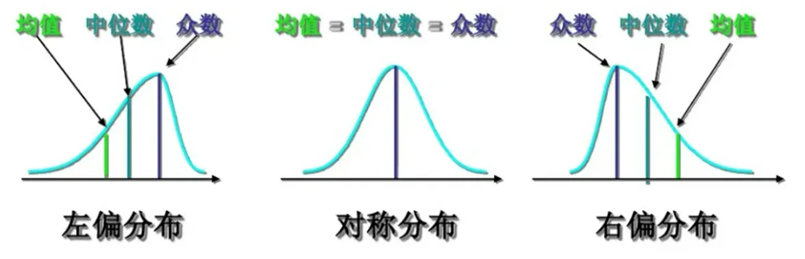

```{r setup, include = FALSE}
knitr::opts_chunk$set(echo = TRUE,
                      dpi = 600,
                      warning = FALSE,
                      message = FALSE,
                      out.width = "100%",
                      out.height = "450px",
                      fig.align = 'center',
                      comment = "#>")
```

卫老师您好:
    
    我是地信2101班的吕文博,今天上课时询问您的关于教材上偏度的问题,课下我翻阅了一些教材和笔记,发现课上我说的也有问题,现将我理解的整理给老师。

- **正态检验中的偏度,其左偏和右偏应该指的是峰值的偏离方向,而不是偏向**

  > 偏度为负,则数据为负偏或左偏,峰值相对均值偏离左方,表示尾部位于分布的左侧,向更多负值延伸
  
  > 偏度为正,则数据为正偏或向右偏,峰值相对均值偏离右方,表示尾部位于分布的右侧,向更正的值延伸

- **正偏分布意味着取值小的数据发生概率大。在正偏分布场合,通常是众数<中位数<均值**

- **负偏分布意味着取值大的数据发生概率大。在负偏分布场合,通常是均值<中位数<众数**



`《Principles of Statistics (Dover, 1979)》`建议:

- 偏度在-0.5到0.5之间,分布是近似对称的
- 偏度在-1到1之间,但不在-0.5到0.5之间, 分布是适度倾斜的
- 偏度在-1到1之外,分布是非常倾斜的

对于表2.4.2的数据,使用`R语言`计算其均值、中位数、众数如下:

```{r}
d = c(12,83,50,35,55,50,72,40,85,29,65,75)

print(paste0('样本均值为',mean(d)))
print(paste0('样本中位数为',median(d)))
print(paste0('样本众数为',modeest::mfv(d)))
print(paste0('样本偏度为',moments::skewness(d)))
```

自己计算的偏度结果同样:

```{r}
calcul_g = \(x){
  xbar = mean(x)
  kexi = sqrt(sum((x - xbar)^2/length(x)))
  g = sum(((x - xbar)/kexi)^3) / length(x)
  return(g)
}

print(paste0('样本偏度为',calcul_g(d)))
```

**课本P28页关于偏度的图实际上并没有问题**,但“显然，其分布为负偏，即平均值在峰值的左边”论述错误。在负偏分布场合,通常是均值<中位数<众数，但此时偏度在-0.5到0.5之间,分布是近似对称的，**所以关于偏度的论述应该加上与±0.5和±1的对比**,对于课本上计算的这个偏度值与我用`R`语言计算的结果不同的原因暂时不知，可能是由小数点保留的，我对`R`语言计算结果有信心。

谢谢老师查看，期待与老师进一步交流