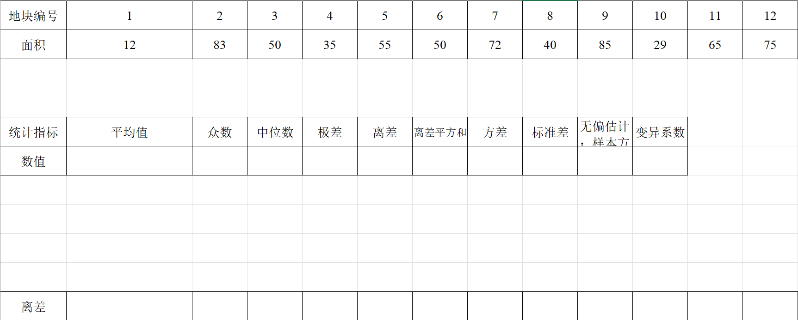
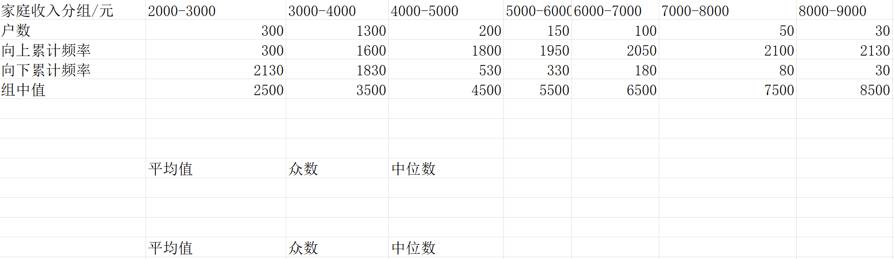

```{r setup, include = FALSE}
knitr::opts_chunk$set(echo = TRUE,
                      dpi = 300,
                      warning = FALSE,
                      message = FALSE,
                      out.width = "100%",
                      out.height = "450px",
                      fig.align = 'center',
                      comment = "##",
                      htmltools.dir.version = FALSE)
```

## 未分组数据常见统计指标计算



```{r}
# 定义计算函数
comstatindic = \(x){
  meanx = mean(x)
  u = unique(x)
  tab = tabulate(match(x, u))
  modex = u[tab == max(tab)]
  medianx = median(x)
  rangex = max(x) - min(x)
  deviationx = x - meanx
  squre_deviationx = sum(deviationx ^ 2)
  variancex = squre_deviationx / length(x)
  sdx = sqrt(variancex)
  unbias_sdx = sqrt(squre_deviationx / (length(x) - 1))
  cvx = unbias_sdx / meanx
  dt1 = c(meanx,modex,medianx,rangex,squre_deviationx,
          variancex,sdx,unbias_sdx,cvx)
  names(dt1) = c("平均值","众数","中位数","极差","离差平方和",
                 "方差","标准差","标准差的无偏估计","变异系数")
  return(list(dt1,"离差" = deviationx))
}

ug = c(12,83,50,35,55,50,72,40,85,29,65,75)
comstatindic(ug)
```

## 分组数据平均值,中位数,众数的计算



#### 首先构造输入数据:

```{r}
g = tibble::tibble(
  家庭收入分组 = paste(seq(2000,8000,by = 1000),
                       seq(3000,9000,by = 1000),
                       sep = "-"),
  户数 = c(300,1300,200,150,100,50,30),
  向上累计频率 = c(300,1600,1800,1950,2050,2100,2130),
  向下累计频率 = c(2130,1830,530,330,180,80,30),
  组中值 = c(2500,3500,4500,5500,6500,7500,8500)
)
g
```

#### 平均值计算

$$
 \overline{x} = \frac{\sum\limits_{i=1}^{m}f_i x_i}{\sum\limits_{i=1}^{m}f_i}
$$

$x_i(i = 1,2,\ldots,m)$代表第$i$组的组中值,如果第$i$组的下限值为$a_i$,
上限值为$b_i$,则$x_i = a_i + \frac{(b_i - a_i)}{2}$;
$f_i$代表第$i$组的频数,$m$为分组个数。

```{r}
# 计算分组数据的平均值
meang = sum(g$`组中值` * g$`户数`) / sum(g$`户数`)
cat("分组数据平均值为",meang)
```

#### 众数计算

**法1**

$$
 M_o = L + d \times \frac{\Delta_1}{\Delta_1 + \Delta_2}
$$

**法2**

$$
 M_o = U - d \times \frac{\Delta_2}{\Delta_1 + \Delta_2}
$$

$M_o$为代求的分组数据的众数,$L$为众数所在组的下限值,$U$为众数所在组的上限值,$\Delta_1$为众数组频数与上一组频数之差,$\Delta_2$为众数组频数与下一组频数之差,$d$为众数所在组的组距

```{r}
calcul_mode = \(popn,floorn,ceiln){
  i = match(max(popn),popn)
  L = floorn[i];U = ceiln[i]
  delta1 = popn[i] - popn[i-1]
  delta2 = popn[i] - popn[i+1]
  d = U - L
  m1 = L + d * delta1 / (delta1 + delta2)
  m2 = U - d * delta2 / (delta1 + delta2)
  m = c(m1,m2)
  setNames(m,c('法1计算的众数','法2计算的众数'))
}

xfloor = seq(2000,8000,by = 1000)
xceil =  seq(3000,9000,by = 1000)
xpop = g$`户数`
modeg = calcul_mode(xpop,xfloor,xceil)
modeg
```

#### 中位数计算

**法1**

$$
 M_e = L + d \times \frac{\frac{1}{2} \sum\limits_{i=1}^{n}f_i - S_{m - 1}}{f_m}
$$

**法2**

$$
 M_e = U - d \times \frac{\frac{1}{2} \sum\limits_{i=1}^{n}f_i - S_{m + 1}}{f_m}
$$

$M_e$为代求的分组数据的中位数,$L$为中位数所在组的下限值,$U$为中位数所在组的上限值,$n$为分组个数,$f_i$为第$i$组对应的频数,$f_m$为中位数所在组的频数,$S_{m-1}$为中位数所在组以下的累积频数,$S_{m+1}$为中位数所在组以上的累积频数,$d$为中位数所在组的组距

```{r}
calcul_median = \(popn,floorn,ceiln){
  halfpop = sum(popn) * 0.5
  i = which(cumsum(popn) - halfpop > 0)[1]
  L = floorn[i];U = ceiln[i]
  d = U - L
  fm = popn[i]
  sms1 = sum(popn[1:(i-1)])
  sma1 = sum(popn[(i+1):length(popn)])
  m1 = L + d * (halfpop - sms1) / fm
  m2 = U - d * (halfpop - sma1) / fm
  m = c(m1,m2)
  setNames(m,c('法1计算的中位数','法2计算的中位数'))
}

xfloor = seq(2000,8000,by = 1000)
xceil =  seq(3000,9000,by = 1000)
xpop = g$`户数`
mediang = calcul_median(xpop,xfloor,xceil)
mediang
```

所以分组数据的平均值为`r meang`,众数为`r modeg[1]`,中位数为`r mediang[1]`.