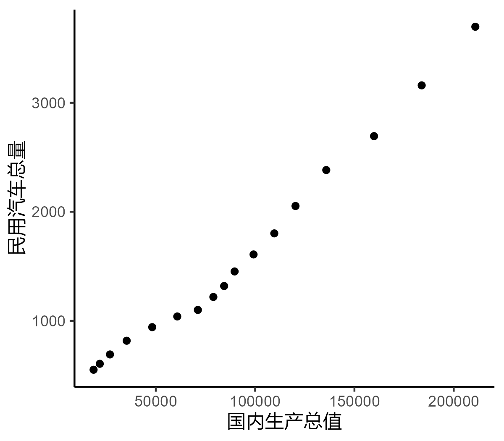

```{r setup, include = FALSE}
knitr::opts_chunk$set(echo = TRUE,
                      dpi = 300,
                      warning = FALSE,
                      message = FALSE,
                      out.width = "100%",
                      out.height = "100%",
                      fig.align = 'center',
                      fig.path = '../picture/rmd/exp5/',
                      comment = "##",
                      htmltools.dir.version = FALSE)
```

## 非线性回归

### 加载数据

```{r}
dt = readxl::read_xls('../data/exp5/5.xls',sheet = "非线性分析")
head(dt)
```

### 绘制散点图

```{r fig1,eval=FALSE}
library(ggplot2)

ggplot() +
  geom_point(data = dt,
             aes(x = 国内生产总值,
                 y = 民用汽车总量)) +
  theme_classic()
```

```{r echo=FALSE, out.width='100%', fig.align="center"}

```

### 常见拟合曲线形式

* `linear`线性模型 $y = b_0 + b_1 x$
* `quadratic`二次模型 $y = b_0+b_1x+b_2x^2$
* `compound`复合模型 $y = b_0{b_1}^x$
* `growth`生长模型 $y = e^{(b_0 + b_1 x)}$
* `logarithmic`对数模型 $y=b_0+b_1\ln(x)$
* `s-curve`S形模型 $y = e^{(b_0 + \frac{b_1}{x})}$
* `cubic` 三次模型 $y = b_0+b_1x+b_2x^2+b_3x^3$
* `exponential`指数模型 $y = b_0 e^{b_1x}$
* `inverse`倒数模型 $y = b_0 + \frac{b_1}{x}$
* `power`幂函数模型 $y = b_0 x^{b_1}$
* `logistic`逻辑斯蒂模型 $y = \frac{1}{\frac{1}{u}+b_0{b_1}^x}$

*回归模型统计诊断指标计算参考了[这篇博客](https://www.cnblogs.com/ykit/p/12501816.html)*

```{r}
performance_nls = \(model){
  require(minpack.lm)
  y_hat = as.double(fitted(model))
  res = as.double(residuals(model))
  y = y_hat + res
  ymean = mean(y)
  df = summary(model)$df
  df1 = length(y) - df[2] - 1
  df2 = df[2]
  SSE = sum(res^2)
  SSR = sum((y_hat-ymean)^2)
  SST = SSE + SSR
  fv = (df2 * SSR) / (df1 * SSE)
  pv = pf(fv,df1 = df1,df2 = df2,lower.tail = FALSE)
  r2 = 1 - SSE/SST
  r = sqrt(r2)
  adjr2 = 1 - ((df1 + df2) * SSE) / (df2 * SST)
  pnls = list("F-statistic" = fv, "P-value" = pv, "R2" = r2, "AdjR2" = adjr2,
              "DF1" = df1, "DF2" = df2, "model_summary" = summary(model))
  class(pnls) = 'performance_nls'
  return(pnls)
}

print.performance_nls = \(resnls,...){
  print(resnls$`model_summary`)
  cat(paste0("Multiple R-squared: ",formatC(resnls$`R2`,digits = 5,format = "g"),", \t",
             "Adjusted R-squared: ",formatC(resnls$`AdjR2`,digits = 5,format = "g")),'\n')
  cat(paste0("F-statistic: ",formatC(resnls$`F-statistic`,digits = 6,format = "g"),
             " on ",resnls$`DF1`," and ",resnls$`DF2`," DF, ",
             "p-value: ",formatC(resnls$`P-value`,digits = 3,format = "e")),'\n')
}
```

### 直接判断拟合曲线类型

#### 三次函数

```{r}
library(minpack.lm)

cubic_lm = nlsLM(民用汽车总量~b0+b1*国内生产总值+b2*国内生产总值^2+b3*国内生产总值^3,data = dt)
performance_nls(cubic_lm)
```

#### 幂函数

```{r}
power_lm = nlsLM(民用汽车总量~b0*国内生产总值^b1,data = dt)
performance_nls(power_lm)
```

三次函数拟合的$R^2$为0.997，幂函数拟合的$R^2$为0.980,三次函数拟合优于幂函数,选择三次函数作为非线性拟合的模型,根据上面的结果可得拟合的曲线为

$$
\text{民用汽车总量} = 0.05264 + 0.002391 \times \text{国内生产总值} + 1.107\times10^{-7} \times \text{国内生产总值}^2 - 2.426\times10^{-13} \times \text{国内生产总值}^3
$$

### 拟合常见的所有曲线

```{r}
nonlinear_fit = \(formula,data,method,...){
  require(minpack.lm)
  formula = stats::as.formula(formula)
  formula.vars = all.vars(formula)
  response = data[, formula.vars[1], drop = TRUE]
  explanatory = data[,formula.vars[2], drop = TRUE]
  data = tibble::tibble(response,explanatory)
  
  switch(method,
         "linear" = {
           model = nlsLM(response~b0+b1*explanatory,data,...)
         },
         "quadratic" = {
           model = nlsLM(response~b0+b1*explanatory+b2*explanatory^2,data,...)
         },
         "compound" = {
           model = nlsLM(response~b0*b1^explanatory,data,...)
         },
         "growth" = {
           model = nlsLM(response~exp(b0+b1*explanatory),data,...)
         },
         "logarithmic" = {
           model = nlsLM(response~b0+b1*log(explanatory),data,...)
         },
         "s" = {
           model = nlsLM(response~exp(b0+b1/explanatory),data,...)
         },
         "cubic" = {
           model = nlsLM(response~b0+b1*explanatory+b2*explanatory^2+b3*explanatory^3,data,...)
         },
         "exponential" = {
           model = nlsLM(response~b0*exp(b1*explanatory),data,...)
         },
         "inverse" = {
           model = nlsLM(response~b0+b1/explanatory,data,...)
         },
         "power" = {
           model = nlsLM(response~b0*explanatory^b1,data,...)
         },
         "logistic" = {
           model = nlsLM(response~1/(1/u+b0*b1^explanatory),data,...)
         })
  
  k = coef(model)
  p = performance_nls(model)
  res = c(method = method,
          R2 = formatC(p$`R2`,digits = 5,format = "g"),
          Pvalue = formatC(p$`P-value`,digits = 3,format = "e"),k) |> 
    tibble::as_tibble_row()
  return(res)
}
```

为了曲线拟合收敛的更快,我们首先对原始数据进行了`log10`变换，然后拟合曲线：

```{r}
dt = dplyr::mutate(dt,dplyr::across(2:3,~log10(.x)))
c("linear","quadratic","compound","growth","logarithmic",
  "s","cubic","exponential","inverse","power","logistic") |> 
  purrr::map(~nonlinear_fit('民用汽车总量~国内生产总值',dt,.x)) |> 
  purrr::list_rbind() |> 
  dplyr::arrange(desc(R2)) -> resnl
resnl
```

由上述结果可知，三次曲线拟合效果最好（计算差异来自数据预先统一进行了`log10`变换）

## 趋势面回归分析

### 加载数据

```{r}
dt = readxl::read_xls('../data/exp5/5.xls',sheet = "趋势面分析")
head(dt)
```

### 定义趋势面分析函数

```{r}
trend.surf = \(formula,data, np = 3){
  require(magrittr)
  formula = stats::as.formula(formula)
  formula.vars = all.vars(formula)
  z = data[, formula.vars[1], drop = TRUE]
  x = data[, formula.vars[2], drop = TRUE]
  y = data[, formula.vars[3], drop = TRUE]
  generatesurf = \(n,x = 'x',y = 'y'){if(n==1){return(paste0(x,'+',y))}
                      else{return(paste0(generatesurf(n-1,x,y),'+',
                                  paste0(x,'^',n:0,'*',y,'^',0:n,
                                         collapse = '+')))}}
  if(np <= 0){
    stop('Please provide a positive integar!')
    }else {
    newdata = generatesurf(np) %>% 
    stringr::str_split('\\+') %>% 
    purrr::pluck(1) %>% 
    purrr::map_dfc(\(i) eval(parse(text = i))) %>% 
    purrr::set_names(paste0('x',1:ncol(.))) %>% 
    dplyr::mutate(z = z)
    }
  surf = lm('z ~ .',data = newdata)
  return(surf)
}
```

### 二次趋势面分析

```{r}
trend2 = trend.surf(z~x+y,dt,2)
summary(trend2)
```

### 三次趋势面分析

```{r}
trend3 = trend.surf(z~x+y,dt,3)
summary(trend3)
```


①二次趋势面$R^2$为0.8386，三次趋势面$R^2$为0.9646，数据与趋势面的拟合程度比较好，三次趋势面的拟合程度更好。
②二次趋势面P值为0.02274<0.05，F检验通过，说明二次趋势面显著;三次趋势面P值为0.1498>0.05， F检验不通过，说明三次趋势面不显著，选用二次趋势面进行拟合比较合理。
③综上，选用二次趋势面进行拟合比较合理。