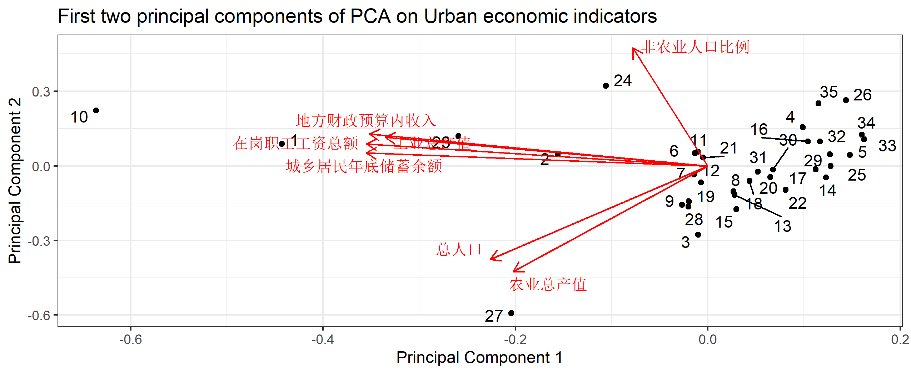

```{r setup, include = FALSE}
knitr::opts_chunk$set(echo = TRUE,
                      dpi = 300,
                      warning = FALSE,
                      message = FALSE,
                      out.width = "100%",
                      out.height = "100%",
                      fig.align = 'center',
                      fig.path = '../picture/rmd/exp6/',
                      comment = "##",
                      htmltools.dir.version = FALSE)
```

## 主成分分析

### 读取和清洗数据

```{r}
library(tidyverse)
library(broom)
library(ggfortify)
urban_econindic = readxl::read_xlsx('../data/exp6/6.xlsx',sheet = 'Chp第16题')
names(urban_econindic) = str_extract(names(urban_econindic),"^[^/]+")
head(urban_econindic) %>% knitr::kable()
```

### 使用baseR的`prcomp`函数联同`tidyverse`执行主成分分析

```{r}
urban_econpca = urban_econindic %>% 
  nest() %>% 
  mutate(pca = map(data, \(x) prcomp(select(x,-`城市编号`),
                                     center = TRUE, scale = TRUE)),
         pca_aug = map2(pca, data, \(x,y) augment(x, data = y)))

urban_econpca

var_exp = urban_econpca %>% 
  unnest(pca_aug) %>% 
  summarise(across(contains(".fittedPC"),\(x) stats::var(x))) %>% 
  gather(key = pc, value = variance) %>% 
  mutate(var_exp = variance / sum(variance),
         cum_var_exp = cumsum(var_exp),
         pc = str_replace(pc, ".fitted", ""))

var_exp
```

**按照特征值大于1的原则,第1主成分的初始特征值为4.31,第2主成分的初始特征值为1.95.从第   3主成分开始,其初始特征值均小于1.因此,选择前2个主成分可以得到$89.6\%$    的累计贡献率,即表示前2个主成分可以解释$89.6\%$ 的总方差.**

### 碎石图

```r
var_exp %>% 
  rename(`Variance Explained` = var_exp,
         `Cumulative Variance Explained` = cum_var_exp) %>% 
  gather(key = key, value = value, `Variance Explained`:`Cumulative Variance Explained`) %>% 
  ggplot(aes(pc, value, group = key)) + 
  geom_point() + 
  geom_line() + 
  facet_wrap(~key, scales = "free_y") +
  theme_bw() +
  lims(y = c(0, 1)) +
  labs(y = "Variance",
       title = "Variance explained by each principal component")
```

```{r echo=FALSE, out.width='100%', fig.align="center"}

```

**从碎石图中可以看出,从第3个组件开始,特征值就处于一个较低的水平.因此选择前2      个主成分是科学的。**

### 将前两个主成分为`x`和`y`轴展示数据

```r
urban_econpca %>%
  mutate(
    pca_graph = map2(
      .x = pca,
      .y = data,
      ~ autoplot(.x, loadings = TRUE, loadings.label = TRUE,
                 loadings.label.repel = TRUE,
                 data = .y, label = TRUE,
                 label.label = "城市编号",
                 label.repel = TRUE) +
        theme_bw() +
        theme(pan)
        labs(x = "Principal Component 1",
             y = "Principal Component 2",
             title = "First two principal components of PCA on Urban economic indicators")
      )
  ) %>%
  pull(pca_graph)
```

```{r echo=FALSE, out.width='100%', fig.align="center"}

```

### 计算综合评价得分

R 中的特征向量默认指向负方向，因此我们将乘以 -1 来反转主成分得分的符号.

```{r}
weight_pca = var_exp %>% 
  dplyr::filter(pc %in% c("PC1","PC2")) %>% 
  pull(variance) %>% 
  {. / sum(.)}
weight_pca

urban_rank = urban_econpca %>% 
  unnest(pca_aug) %>% 
  select(城市编号,num_range(".fittedPC",1:2)) %>% 
  mutate(across(-城市编号,\(x) -x)) %>% 
  mutate(综合得分 = weight_pca[1] * .fittedPC1 + weight_pca[2] * .fittedPC2) %>% 
  mutate(综合排名 = min_rank(desc(综合得分))) %>% 
  select(城市编号,综合得分,综合排名) %>% 
  arrange(综合排名)
```

**注: 与SPSS结果计算有出入,SPSS中通过因子分析和综合得分两步得出结果,R直接可以运行主成分分析，R计算结果较准确**

#### 城市综合排名

```{r}
knitr::kable(urban_rank)
```

#### 综合实力前五城市

```{r}
urban_rank %>% 
  head(5) %>% 
  knitr::kable()
```

#### 综合实力后五城市

```{r}
urban_rank %>% 
  tail(5) %>% 
  knitr::kable()
```