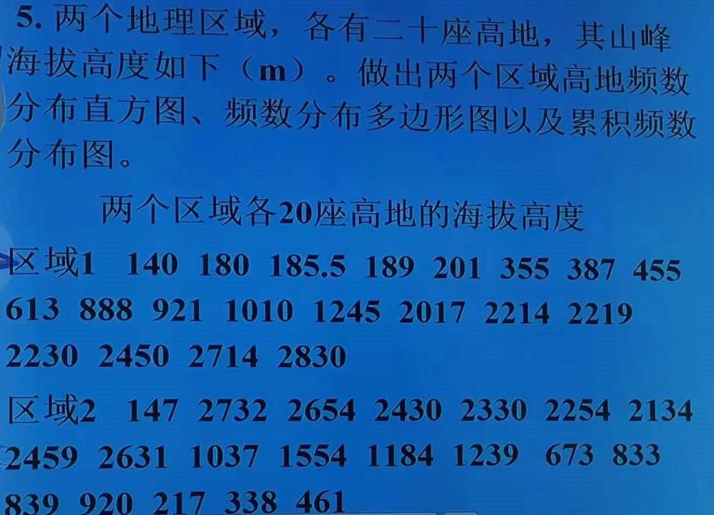

```{r setup, include = FALSE}
knitr::opts_chunk$set(echo = TRUE,
                      dpi = 600,
                      warning = FALSE,
                      message = FALSE,
                      out.width = "100%",
                      out.height = "450px",
                      fig.align = 'center',
                      comment = "#>",
                      htmltools.dir.version = FALSE)
```

# 第一题:



存储两个区域的海拔高度

```{r}
h1 = c(140,180,185.5,189,201,355,387,455,613,888,
       921,1010,1245,2017,2214,2219,2230,2450,2714,2830)

h2 = c(147,2732,2654,2430,2330,2254,2134,2459,2631,1037,
       1554,1184,1239,673,833,839,920,217,338,461)
```

# 解:

两个区域海拔高度各20个样本，则经验分组数`n`为`N = 1 + 3.32 * log10(n)`个,约
`r floor(1+3.32*log10(20))` 个

区域1极差为`r max(h1) - min(h1)`,区域2极差为`r max(h2) - min(h2)`

则区域1组距为`r round((max(h1) - min(h1)) / 5,2)`，区域2组距为
`r round((max(h2) - min(h2)) / 5,2)`

区域1自`r min(h1)` 至 `r max(h1)`共 5 组

区域2自`r min(h2)` 至 `r max(h2)`共 5 组

```{r}
library(tidyverse)

geom_cumufreq = \(data,class,newnum){
  newnum = tibble(n1 = newnum,
                  n2 = lead(newnum)) |> 
    mutate(n = (n1 + n2) / 2) |> 
    pull(n) |> 
    na.omit()
  dtcu = data %>% 
    group_by({{class}}) %>% 
    summarise(freq = n()) %>%
    arrange(class) %>%
    mutate(cum_freq = cumsum(freq)) %>% 
    mutate(newnum = newnum)
  p = ggplot(dtcu, aes(x = {{newnum}}, y = cum_freq)) +
  geom_line() +
  geom_point() +
  scale_y_continuous(name = "累积频数",
                     expand = c(0,0),
                     limits = c(0,25),
                     breaks = seq(0,25,5))
  return(p)
}

h1 = tibble(height = h1) %>% 
  mutate(class = cut(h1, include.lowest = T, right = F, labels = F,
                     breaks = seq(min(h1), max(h1), by = 538)))
h2 = tibble(height = h2) %>% 
  mutate(class = cut(h2, include.lowest = T, right = F, labels = F,
                     breaks = seq(min(h2), max(h2), by = 517)))

y1 = h1 %>% 
  group_by(class) %>% 
  summarise(freq = n()) %>% 
  pull(freq) %>% 
  max()

y2 = h1 %>% 
  group_by(class) %>% 
  summarise(freq = n()) %>% 
  pull(freq) %>% 
  max()

y1 = y1 + 1; y2 = y2 + 1

ggplot(data = h1) +
  geom_histogram(aes(height),
                 color='white',fill='gray60',
                 breaks = seq(140,2830,by = 538)) +
  scale_y_continuous(name = "频数",
                     expand = c(0,0),
                     breaks = 0:y1) +
  scale_x_continuous(name = '区域1海拔高度',
                     breaks = seq(140,2830,by = 538)) +
  theme_classic() -> h11

ggplot(data = h1) +
  geom_freqpoly(aes(height),
                breaks = seq(140,2830,by = 538)) +
  scale_y_continuous(name = "频数",
                     expand = c(0,0),
                     breaks = 0:y1) +
  scale_x_continuous(name = '区域1海拔高度',
                     breaks = seq(140,2830,by = 538)) +
  theme_classic() -> h12

geom_cumufreq(h1,class,seq(140,2830,by = 538)) +
  scale_x_continuous(name = '区域1海拔高度',
                     limits = c(140,2830),
                     breaks = seq(140,2830,by = 538)) +
  theme_classic() -> h13

ggplot(data = h2) +
  geom_histogram(aes(height),
                 color='white',fill='gray60',
                 breaks = seq(147,2732,by = 517)) +
  scale_y_continuous(name = "频数",
                     expand = c(0,0),
                     breaks = 0:y2) +
  scale_x_continuous(name = '区域2海拔高度',
                     breaks = seq(147,2732,by = 517)) +
  theme_classic() -> h21

ggplot(data = h2) +
  geom_freqpoly(aes(height),
                breaks = seq(147,2732,by = 517)) +
  scale_y_continuous(name = "频数",
                     expand = c(0,0),
                     breaks = 0:y2) +
  scale_x_continuous(name = '区域2海拔高度',
                     breaks = seq(147,2732,by = 517)) +
  theme_classic() -> h22

geom_cumufreq(h2,class,seq(147,2732,by = 517)) +
  scale_x_continuous(name = '区域2海拔高度',
                     limits = c(140,2830),
                     breaks = seq(147,2732,by = 517)) +
  theme_classic() -> h23

library(patchwork)

(h11 + h21) / (h12 + h22) / (h13 + h23)
```

