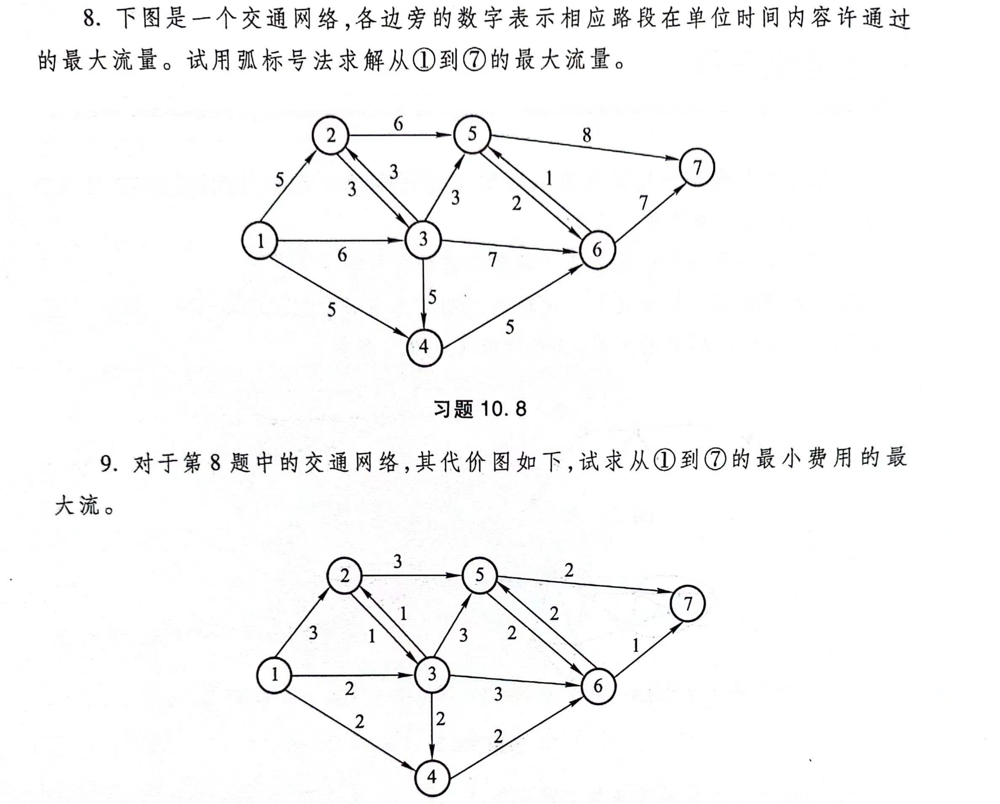

```{r setup, include = FALSE}
knitr::opts_chunk$set(echo = TRUE,
                      dpi = 300,
                      warning = FALSE,
                      message = FALSE,
                      # out.width = "100%",
                      # out.height = "100%",
                      fig.align = 'center',
                      comment = "##",
                      htmltools.dir.version = FALSE)
```

```{r echo=FALSE, out.width='75%'}

```

```{r fig.width=4.5,fig.height=5.5}
library(igraph)
library(tidygraph)
library(tidyverse)

nodes = tibble::tibble(name = paste0('V',1:7))
edges = tibble::tibble(
  from = c(rep(1,3),rep(2,2),rep(3,3),4,5,5,6,6),
  to = c(2:4,3,5,4:6,6,6,7,5,7),
  capacity = c(5,6,5,3,6,5,3,7,5,2,8,1,7),
  cost = c(3,2,2,1,3,2,3,3,2,2,2,2,1),
  ID = 1:length(cost)
)

g = tbl_graph(nodes = nodes, edges = edges, directed = TRUE)
maxflow_result = igraph::max_flow(as.igraph(g),source = 'V1',target = 'V7')
cat('最大流量:',maxflow_result$value)
ig = as.igraph(g)
plot(ig, edge.label = maxflow_result$flow)

createConstraintsMatrix = \(edges, total_flow) {
  names_edges <- edges$ID
  numberof_edges <- length(names_edges)
  names_nodes <- c(edges$from, edges$to) %>% unique()
  numberof_nodes <- length(names_nodes)
  constraints <- list(lhs = NA,
                      dir = NA,
                      rhs = NA)
  constraints$lhs <- edges$ID %>%
    length() %>%
    diag()
  colnames(constraints$lhs) = edges$ID
  constraints$dir <- rep('<=', times = nrow(edges))
  constraints$rhs <- edges$capacity
  nodeflow <- matrix(0,
                     nrow = numberof_nodes,
                     ncol = numberof_edges,
                     dimnames = list(names_nodes, names_edges))
  for (i in names_nodes) {
    edges_in <- edges %>%
      filter(to == i) %>%
      select(ID) %>%
      unlist()
    edges_out <- edges %>%
      filter(from == i) %>%
      select(ID) %>%
      unlist()
    nodeflow[
      rownames(nodeflow) == i,
      colnames(nodeflow) %in% edges_in] <- 1
    nodeflow[
      rownames(nodeflow) == i,
      colnames(nodeflow) %in% edges_out] <- -1
  }
  sourcenode_id <- min(edges$from)
  targetnode_id <- max(edges$to)
  nodeflow_source <- nodeflow[rownames(nodeflow) == sourcenode_id,]
  nodeflow_target <- nodeflow[rownames(nodeflow) == targetnode_id,]
  nodeflow <- nodeflow[!rownames(nodeflow) %in% c(sourcenode_id, targetnode_id),]
  constraints$lhs <- rbind(constraints$lhs, nodeflow)
  constraints$dir <- c(constraints$dir, rep('==', times = nrow(nodeflow)))
  constraints$rhs <- c(constraints$rhs, rep(0, times = nrow(nodeflow)))
  constraints$lhs <- rbind(constraints$lhs,
                           source = nodeflow_source,
                           target = nodeflow_target)
  constraints$dir <- c(constraints$dir, rep('==', times = 2))
  constraints$rhs <- c(constraints$rhs, total_flow * -1, total_flow)

  return(constraints)
}

constraintsMatrix = createConstraintsMatrix(edges, 15)
solution = lpSolve::lp(direction = 'min',
                       objective.in = edges$cost,
                       const.mat = constraintsMatrix$lhs,
                       const.dir = constraintsMatrix$dir,
                       const.rhs = constraintsMatrix$rhs)
cat('最小费用流总代价:',solution$objval)

ig = as.igraph(g)
plot(ig, edge.label = solution$solution)
```

