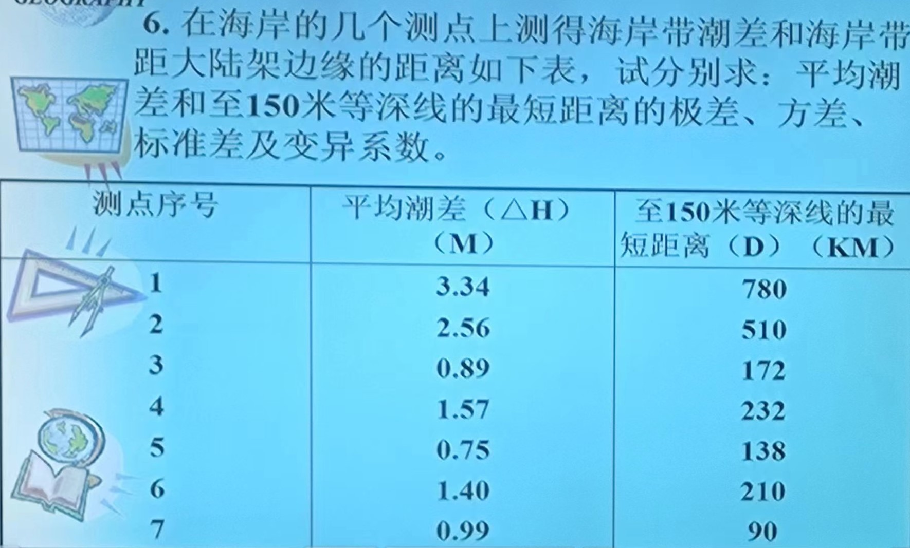
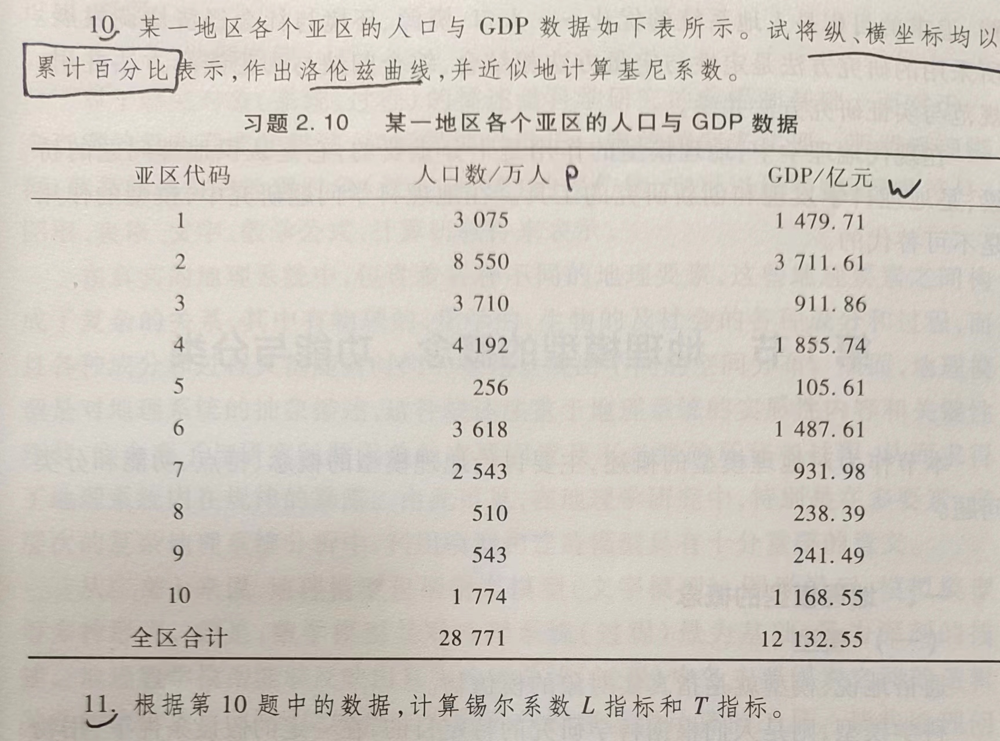

```{r setup, include = FALSE}
knitr::opts_chunk$set(echo = TRUE,
                      dpi = 600,
                      warning = FALSE,
                      message = FALSE,
                      out.width = "100%",
                      out.height = "450px",
                      fig.align = 'center',
                      comment = "#>",
                      htmltools.dir.version = FALSE)
```

# 第一题



```{r}
describe_summary = \(x){
  R = max(x) - min(x)
  xbar = mean(x)
  sigma2 = mean((x - xbar)^2)
  sigma = sqrt(sigma2)
  s = sd(x)
  cv = s / xbar
  describe = c(R,sigma2,sigma,cv)
  names(describe) = c('极差','方差','标准差','变异系数')
  return(describe)
}

h = c(3.34,2.56,0.89,1.57,0.75,1.40,0.99)
d = c(780,510,172,232,138,210,90)
```

#### 平均潮差（单位:M):
```{r}
describe_summary(h)
```

#### 至150m等深线的最短距离（单位:KM):
```{r}
describe_summary(d)
```

# 第二&三题



## 第二题答案

**计算需要的数据:**
```{r}
library(tidyverse)
p = c(3075,8550,3710,4192,256,3618,2543,510,543,1774)
w = c(1479.71,3711.61,911.86,1855.74,105.61,1487.61,931.98,238.39,241.49,1168.55)
dt = tibble(p = p,w = w) |> 
  mutate(across(everything(),\(x) x / sum(x))) |> 
  mutate(wprate = w / p) |> 
  arrange(wprate) |> 
  mutate(pcum = cumsum(p),wcum = cumsum(w))
dt
```

#### 绘制洛伦兹曲线
```{r}
library(showtext)
font_add("simsun","simsun.ttc")
font_add("times","times.ttf")
showtext_auto(enable=TRUE)

ggplot(data = dt |> 
         select(pcum,wcum) |> 
         add_row(tibble(pcum = 0, wcum = 0)) |> 
         arrange(wcum),
       aes(x = pcum,y = wcum)) +
  geom_line(linewidth = 0.5) +
  geom_point(aes(shape = '实际分布'),size = 1.5) +
  geom_abline(slope = 1,intercept = 0,lty = "dashed") +
  scale_x_continuous(name = '人口比重累计',expand = c(0,0),
                     limits = c(0,1.01),breaks = seq(0,1,by = 1/5)) +
  scale_y_continuous(name = "收入比重累计",expand = c(0,0),
                     limits = c(0,1.01),breaks = seq(0,1,by = 1/5)) +
  scale_shape_manual(name = '',breaks = c('实际分布'),
                     values = c('实际分布' = 2)) +
  coord_equal() +
  ggthemes::theme_few() +
  theme(axis.ticks = element_line(linetype = 1,linewidth = 0.25),
        axis.text = element_text(size = 52.5,family = "times"),
        axis.title = element_text(size = 52,family = "simsun"),
        legend.position = c(0.05,0.95),
        legend.justification = c(0,1),
        legend.text = element_text(size = 52,family = "simsun"))
```

#### 按曲线拟合法计算基尼系数
```{r}
x = dt$pcum
y = dt$wcum
beta = sum(log(x)*log(y)) / sum((log(x))^2)
gini = (beta-1) / (1+beta)
gini
```

#### 基于R包`DescTools::Gini()`
```{r}
DescTools::Gini(w,p)
```

## 第三题答案

### Theil L系数
```{r}
TheilL = sum(dt$p * log(dt$p/dt$w,base = 10))
TheilL
```

### Theil T系数
```{r}
TheilT = sum(dt$w * log(dt$w/dt$p,base = 10))
TheilT
```
