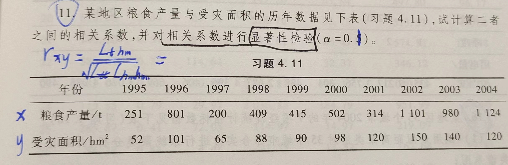
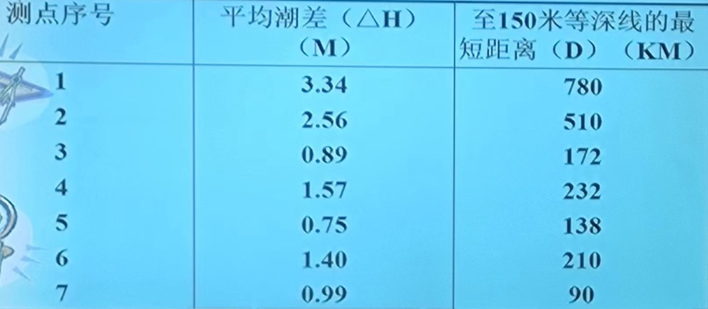

```{r setup, include = FALSE}
knitr::opts_chunk$set(echo = TRUE,
                      dpi = 600,
                      warning = FALSE,
                      message = FALSE,
                      out.width = "100%",
                      out.height = "450px",
                      fig.align = 'center',
                      comment = "#>",
                      htmltools.dir.version = FALSE)
```


**参考资料: [1](https://www.statology.org/correlation-test-in-r/) 
            [2](https://statsandr.com/blog/correlation-coefficient-and-correlation-test-in-r/)**

# 第一题



## 自编写函数实现计算：

```{r}
t = c(251,801,200,409,415,502,314,1101,980,1124)
hm2 = c(52,101,65,88,90,98,120,150,140,120)

calcor2 = \(x1,x2){
  x1bar = mean(x1,na.rm = T)
  x2bar = mean(x2,na.rm = T)
  cor2 = sum((x1-x1bar)*(x2-x2bar)) / sqrt(sum((x1-x1bar)^2)*sum((x2-x2bar)^2))
  return(cor2)
}

calcor2(t,hm2)
```

我们测算出来的皮尔逊相关性系数为`r calcor2(t,hm2)`,自由度`f`为`r length(t) -2`,
在显著性水平$\alpha$ = 0.10上查表可得对应的${r}_{0.10}$ = 0.5494,而
`r calcor2(t,hm2)` > 0.5494, 所以该地区粮食产量与受灾面积的相关性在0.1的显著性水平下显著

## 基于`r`自带的`cor`和`cor.test`函数运算

```{r}
t = c(251,801,200,409,415,502,314,1101,980,1124)
hm2 = c(52,101,65,88,90,98,120,150,140,120)

cor2 = cor(t,hm2,method = "pearson")
cor2
cor.test(t,hm2,method = "pearson")
```

# 第二题
**计算如下数据的相关系数并拟合一个一元线性回归**



## 自己写函数求解 

```{r}
h = c(3.34,2.56,0.89,1.57,0.75,1.40,0.99)
d = c(780,510,172,232,138,210,90)
calcor2 = \(x1,x2){
  x1bar = mean(x1,na.rm = T)
  x2bar = mean(x2,na.rm = T)
  cor2 = sum((x1-x1bar)*(x2-x2bar)) / sqrt(sum((x1-x1bar)^2)*sum((x2-x2bar)^2))
  return(cor2)
}

calculm = \(x,y){
  xbar = mean(x,na.rm = T)
  ybar = mean(y,na.rm = T)
  lxx = sum((x - xbar)^2)
  lxy = sum((x-xbar)*(y-ybar))
  bhat = lxy / lxx
  ahat = ybar - bhat * xbar
  yhat = bhat * x + ahat
  Q = sum((y - yhat)^2)
  U = sum((yhat - ybar)^2)
  F_statistic = U / (Q / (length(x) - 2))
  lmv = c(bhat,ahat,F_statistic)
  names(lmv) = c('系数','截距','F统计量')
  return(lmv)
}

calcor2(h,d)
calculm(d,h)
```

我们测算出来的皮尔逊相关性系数为`r calcor2(h,d)`,自由度`f`为`r length(h) -2`,
在显著性水平$\alpha$ = 0.10上查表可得对应的${r}_{0.10}$ = 0.6694,而
`r calcor2(t,hm2)` > 0.6694, 所以平均潮差与至150m等深线的最短距离的相关性在0.1的显著性水平下显著

查表可知${F}_{0.10}$(1,`r length(h) - 2`) = 4.06,而110.6 > 4.06,
所以该一元线性回归在显著性水平为0.1下显著

## 基于`r`的`lm`和`summary`函数

```{r}
h = c(3.34,2.56,0.89,1.57,0.75,1.40,0.99)
d = c(780,510,172,232,138,210,90)

cor(h,d,method = 'pearson')
cor.test(h,d,method = 'pearson')

lm.model = lm(h ~ d, data = data.frame(h,d))
summary(lm.model)
```