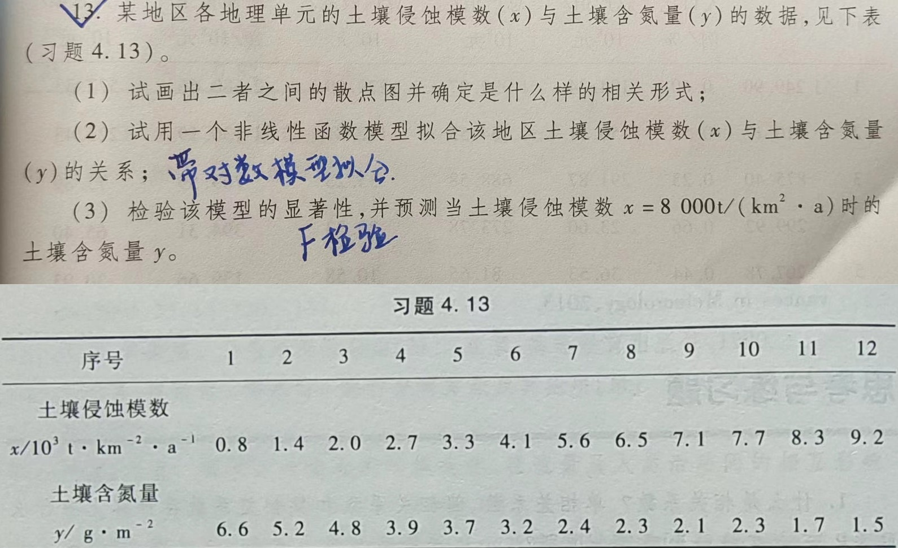

```{r setup, include = FALSE}
knitr::opts_chunk$set(echo = TRUE,
                      dpi = 600,
                      warning = FALSE,
                      message = FALSE,
                      out.width = "100%",
                      out.height = "450px",
                      fig.align = 'center',
                      comment = "#>",
                      htmltools.dir.version = FALSE)
```

# 题目如下:



### (1) 绘制两者间的散点图并确定相关形式

```{r,fig.height = 4, fig.width = 9, fig.align = "center"}
library(showtext)
showtext_auto(enable = TRUE)
font_add("simsun", regular = "C:/Windows/Fonts/simsun.ttc")
font_add("times", regular = "C:/Windows/Fonts/times.ttf")
font_add("suntimes", regular = fs::path(Sys.getenv("root_document"),
                                        'dailywork/vlog/fonts/suntimes.ttf'))
library(tidyverse)

x = c(0.8,1.4,2.0,2.7,3.3,4.1,5.6,6.5,7.1,7.7,8.3,9.2)
y = c(6.6,5.2,4.8,3.9,3.7,3.2,2.4,2.3,2.1,2.3,1.7,1.5)

soildf = tibble(x,y)

fig1 = ggplot(data = soildf) + 
  geom_smooth(aes(x=x,y=y),color = 'grey',lwd = 1,se = F) +
  geom_point(aes(x = x, y = y),size = 1.25, shape = 2) +
  scale_x_continuous(name = latex2exp::TeX("土壤侵蚀模数($10^3t$$\\cdot$$km^{-2}$$\\cdot$$a^{-1}$)"),    
                     expand = c(0,0),
                     limits = c(0.5,9.51),
                     breaks = seq(0.5,9.5,by = 1/2)) +
  scale_y_continuous(name = latex2exp::TeX("土壤含氮量($g$$\\cdot$$m^{-2}$)"),
                     expand = c(0,0),
                     limits = c(1.42,7),
                     breaks = seq(1.5,7,by = 1/2)) +
  coord_equal() +
  ggthemes::theme_few() +
  theme(axis.ticks = element_line(linetype = 1,linewidth = 0.25),
        axis.text = element_text(size = 50,family = 'times'),
        axis.title = element_text(size = 60))

fig2 = ggplot(data = soildf) + 
  geom_smooth(aes(x = log(x),y = log(y)),color = 'grey',
              lwd = 1,se = F, method = 'lm') +
  geom_point(aes(x = log(x),y = log(y)),size = 1.25, shape = 2) +
  scale_x_continuous(name = latex2exp::TeX("$\\ln$土壤侵蚀模数($10^3t$$\\cdot$$km^{-2}$$\\cdot$$a^{-1}$)"),    
                     expand = c(0,0),
                     limits = c(-0.5,2.5),
                     breaks = seq(-0.5,2.5,by = 1/5)) +
  scale_y_continuous(name = latex2exp::TeX("$\\ln$土壤含氮量($g$$\\cdot$$m^{-2}$)"),
                     expand = c(0,0),
                     limits = c(0,2),
                     breaks = seq(0,2,by = 1/5)) +
  coord_equal() +
  ggthemes::theme_few() +
  theme(axis.ticks = element_line(linetype = 1,linewidth = 0.25),
        axis.text = element_text(size = 50,family = 'times'),
        axis.title = element_text(size = 60))

library(patchwork)

fig1 + fig2 +
  plot_annotation(title = '土壤侵蚀模数与土壤含氮量的相关关系',
                  subtitle = '图a为原始数据的相关关系,图b为双对数变换后的相关关系',
                  tag_levels = 'a',
                  theme = theme(plot.title = element_text(size = 75,family = "simsun"),
                                plot.subtitle = element_text(size = 65,family = "suntimes"))) &
                  theme(plot.tag = element_text(size = 60,family = "times"))
```

### (2) 使用双对数模型拟合土壤侵蚀模数 (`x`) 与土壤含氮量 (`y`) 的关系

```{r}
soildf = soildf %>% 
  mutate(lnx = log(x),lny = log(y))

ln2lm = lm(lny~lnx,data = soildf)
broom::tidy(ln2lm)
stargazer::stargazer(ln2lm,header = T,type = 'text')
```

拟合出来的土壤侵蚀模数 (`x`) 与土壤含氮量 (`y`) 的关系为

$$\begin{gather*}
\ln y = -0.581 \ln x + 1.888 \tag{1} \\
y = 6.60614 x^{-0.581} \tag{2}
\end{gather*}$$

### (3) 检验该模型的显著性并预测当土壤侵蚀模数 $x = 8000 t / (km^2 \cdot a)$时的土壤含氮量 `y`

计算拟合的双对数模型斜率 `k` 为 -0.581, 截距 `b` 为 1.888, `F` 统计量为 184.642,
而在$\alpha$ = 0.005的显著性水平下 $F_{(1,10)}$ = 12.83, 而 184.642 > 12.83,所以拟合的
双对数模型在$\alpha$ = 0.005的显著性水平下显著

```{r}
predict(ln2lm, data.frame(lnx=log(8))) %>% exp()
```

所以,当土壤侵蚀模数 $x = 8000 t / (km^2 \cdot a)$时的土壤含氮量 
$y = 1.971748 / g \cdot m^{-2}$
