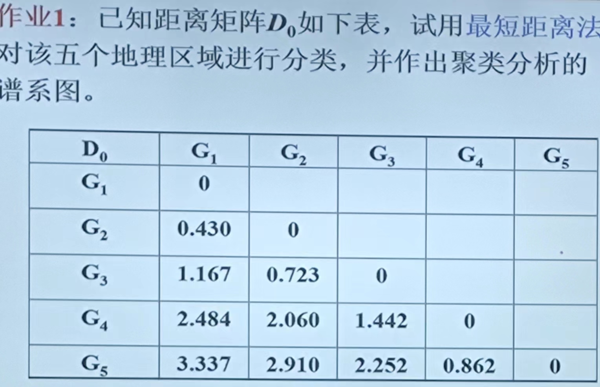
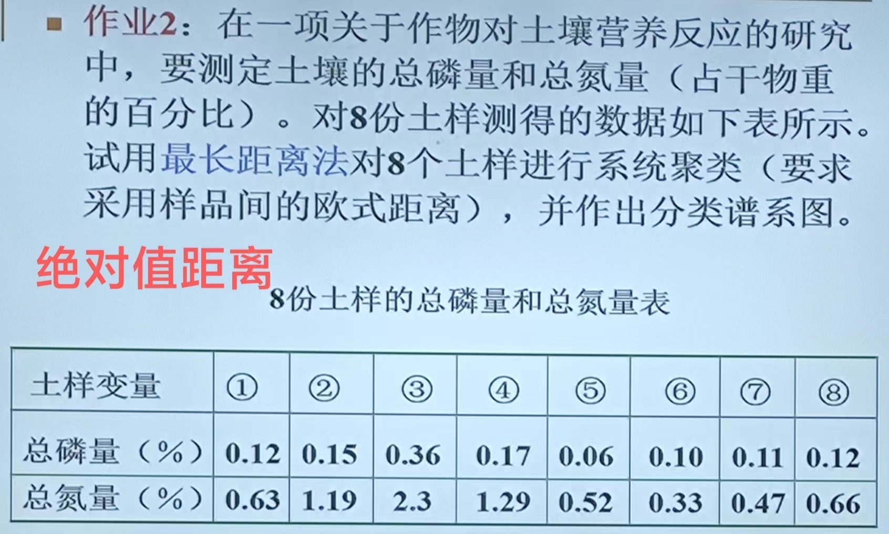

```{r setup, include = FALSE}
knitr::opts_chunk$set(echo = TRUE,
                      dpi = 600,
                      warning = FALSE,
                      message = FALSE,
                      out.width = "100%",
                      out.height = "450px",
                      fig.align = 'center',
                      comment = "#>",
                      htmltools.dir.version = FALSE)
```

### `baseR`函数`hclust`的`method`参数中:

- `ward.D` Ward 的最小方差方法,基于欧氏距离的平方

- `ward.D2` Ward 的最小方差方法,基于欧氏距离的平方和

- `single` 最小距离法

- `complete` 最大距离法

- `average` 类平均距离法

- `mcquitty` 类加权平均距离法

- `median` 中间距离法

- `centroid` 重心距离法

参考[这个](https://www.math.pku.edu.cn/teachers/lidf/course/mvr/mvrnotes/html/_mvrnotes/mvr-cluster.html#cluster-hier)

# 第一题:



```{r}
d = matrix(c(rep(0,5),0.430,rep(0,4),1.167,0.723,rep(0,3),
             2.484,2.060,1.442,0,0,3.337,2.910,2.252,0.862,0),
           byrow = T,nrow = 5)
d = as.dist(d,diag = T)
clus1 = hclust(d, method = "single")
library(ggplot2)
library(ggdendro)
ggdendrogram(clus1, rotate = FALSE, size = 2) +
  xlab('类别') +
  ylab('特征距离') +
  theme_bw()
```

# 第二题:



```{r}
p = c(0.12,0.15,0.36,0.17,0.06,0.10,0.11,0.12)
n = c(0.63,1.19,2.3,1.29,0.52,0.33,0.47,0.66)
d = cbind(p,n) |> dist(method = 'manhattan', diag = TRUE)
clus2 = hclust(d, method="complete")
library(ggplot2)
library(ggdendro)
ggdendrogram(clus2, rotate = FALSE, size = 2) +
  xlab('类别') +
  ylab('特征距离') +
  theme_bw()
```