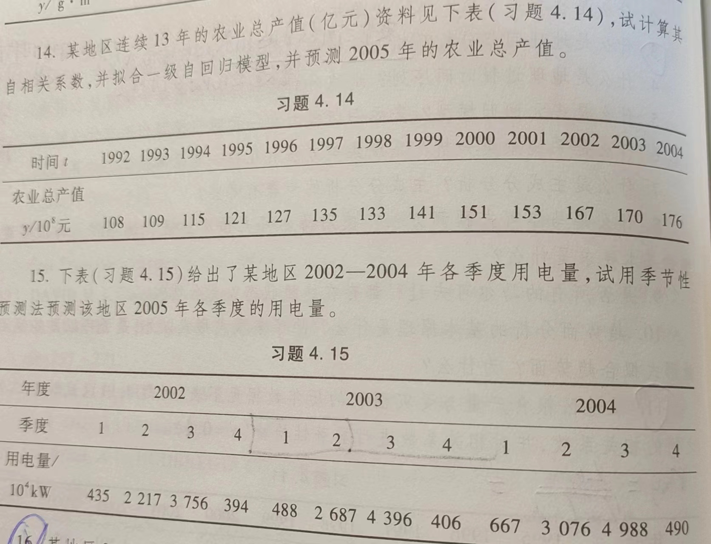

```{r setup, include = FALSE}
knitr::opts_chunk$set(echo = TRUE,
                      dpi = 600,
                      warning = FALSE,
                      message = FALSE,
                      out.width = "100%",
                      out.height = "450px",
                      fig.align = 'center',
                      comment = "#>",
                      htmltools.dir.version = FALSE)
```


# 马尔可夫预测

```{r}
x1 = c(0.4,0.3,0.3)
p = matrix(c(0.45,0.35,0.20,0.40,0.40,0.20,0.80,0.10,0.10),
           nrow = 3, byrow = T)
x2 = x1 %*% p
x3 = x2 %*% p
finalstate = solve(rbind((t(p) - diag(3))[1:2,],rep(1,3)),
      c(rep(0,2),1))
```

```{r}
cat('一年后市场占有率:',x2)
cat('两年后市场占有率:',x3)
cat('最终市场占有率:',finalstate)
```



### 14. 

```{r}
tagri = c(108,109,115,121,127,135,133,141,151,153,167,170,176)
acf(tagri, lag.max = 1, type = "correlation",plot = F)
tfit = ar(tagri, method = "ols",order.max = 1)
forecast_result = predict(tfit, n.ahead = 1)
forecast_result
```

### 15. 

```{r}
x = c(435,2217,3756,394,488,2687,4396,406,667,3076,4988,490)
x_ts = ts(x, frequency = 4)
decompose(x_ts)
acf(tagri, lag.max = 1, type = "correlation",plot = F)
tfit = ar(tagri, method = "ols",order.max = 1)
tfit
forecast_result = predict(tfit, n.ahead = 1)
forecast_result
```