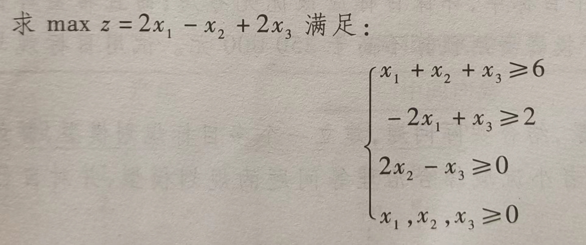
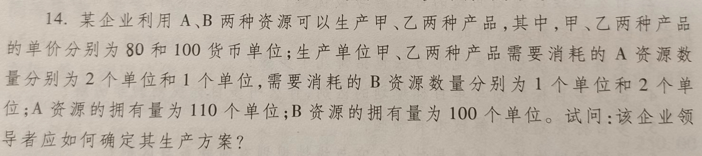

```{r setup, include = FALSE}
knitr::opts_chunk$set(echo = TRUE,
                      dpi = 600,
                      warning = FALSE,
                      message = FALSE,
                      out.width = "100%",
                      out.height = "450px",
                      fig.align = 'center',
                      comment = "#>",
                      htmltools.dir.version = FALSE)
```



```{r}
library(lpSolve)

tryCatch({
lp(direction = 'max',
         objective.in = c(2,-1,2),
         const.mat = matrix(c(rep(1,3),
                            -2,0,1,
                            0,2,-1),
                            nrow = 3,
                            byrow = T),
         const.rhs = c(6,2,0),
         const.dir = rep('>=',3))
},error = function(e){
  print("无最优解!")
})

```

```{r}
solveLp = function(c,A,b,lav){ 
  n = ncol(A);m = nrow(A)
  sol = rep(0,n)
  for(i in 1:length(lav))sol[lav[i]] = b[i]
  B = lav 
  sigma = c - c[lav]%*%A
  print("初始单纯形表:")
  DF = data.frame("CB" = c[B],"Base" = B,"b"=b, "x" = A)
  print(list("frame" = DF,"sigma" = sigma))
  while(any(sigma>0))
  { 
    infty = which(sigma>0)
    for(i in infty)if(all(A[,i] <= 0))print("答：存在无界解！")
    psigma = max(sigma)    
    pcol = which(sigma == psigma)
    sita0 = b/A[,pcol]
    sita = min(sita0)
    prow = which(sita0 == sita)    
    B[prow] = pcol       
    
    b[prow] = b[prow]/A[prow,pcol]    
    A[prow,] = A[prow,]/A[prow,pcol]
    for(i in c(1:m)[-prow])
    {
      b[i] = b[i] - b[prow]*A[i,pcol]
      A[i,] = A[i,] - A[prow,]*A[i,pcol]
    }
    sigma = c - c[B]%*%A
    print("过程单纯形表:")
    DF = data.frame("CB" = c[B],"Base" = B,"b"=b, "x" = A)
    print(list("frame" = DF,"sigma" = sigma))
  }
  if(any(sigma[-B]==0))
  {print("答：存在无穷多最优解！")
  } else {print("答：唯一最优解！")}
  print("最终单纯形表:")
  DF = data.frame("CB" = c[B],"Base" = B,"b"=b, "x" = A)
  print(list("goal coef" = c,"frame" = DF,"sigma" = sigma))
  sol = rep(0,n)
  for(i in 1:length(B))sol[B[i]] = b[i]
  return(list("最优解"=sol,"最大值"=sum(sol*c)))
} 

# q2-1
solveLp(c = c(2,1,0,0),
        A = matrix(c(3,6,5,2,rep(0,4)),nrow = 2),
        b = c(15,24),
        lav = c(3,4))

# q2-2
solveLp(c = c(2,5,rep(0,3)),
        A = matrix(c(1,rep(0,4),
                     0,1,rep(0,3),
                     3,2,rep(0,3)),
                   nrow = 3,byrow = T),
        b = c(4,6,18),
        lav = c(3,4,5))
```



```{r}
solveLp(c = c(80,100,rep(0,2)),
        A = matrix(c(2,1,rep(0,2),
                     1,2,rep(0,2)),
                   nrow = 2,byrow = T),
        b = c(110,100),
        lav = c(3,4))
```

