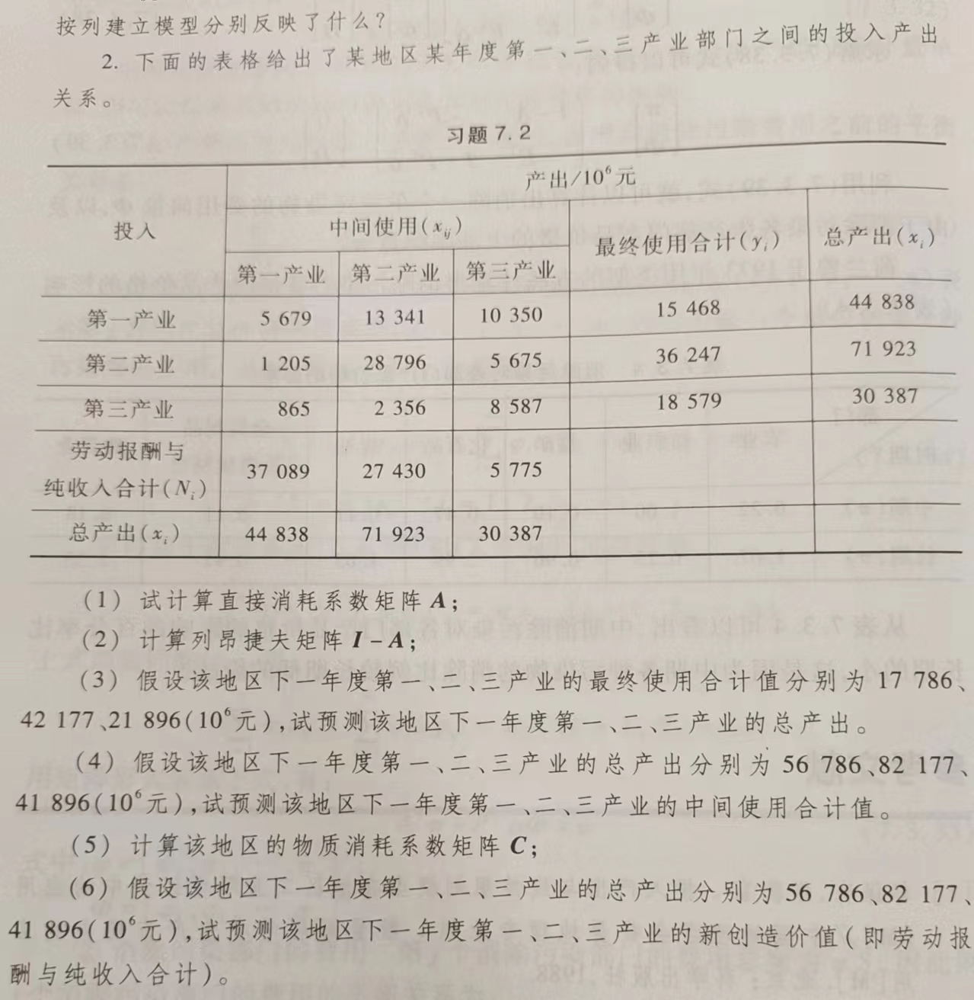

```{r setup, include = FALSE}
knitr::opts_chunk$set(echo = TRUE,
                      dpi = 300,
                      warning = FALSE,
                      message = FALSE,
                      # out.width = "100%",
                      # out.height = "100%",
                      fig.align = 'center',
                      comment = "##",
                      htmltools.dir.version = FALSE)
```



```{r}
X = matrix(c(5679, 13441, 10350, 
             1205, 28796, 5675, 
             865, 2356, 8587), 
            nrow = 3, byrow = TRUE)

y = c(15468,36247,18579)  # 最终使用
x = c(44838,71923,30387)  # 总产出
N = c(37089,27430,5775)   # 新创造价值

A = sweep(X, 2, x, FUN = "/")
cat("直接消耗系数矩阵 A:");A

I = diag(3)
I_minus_A = I - A
cat("列昂捷夫矩阵 I - A:");I_minus_A

y_new = c(17786, 42177, 21896)
x_new = solve(I_minus_A) %*% y_new
cat("新的总产出 x_new:");x_new |> as.vector()

x_new = c(56786, 82177, 41896)
X_new = x_new - I_minus_A %*% x_new
cat("新的中间使用合计值 X_new:",X_new)

C = diag((x - N)/ x)
cat("物质消耗系数矩阵 C:");C

N_new = diag(1 - C) * x_new
cat("新的价值创造 N_new:");N_new
```
